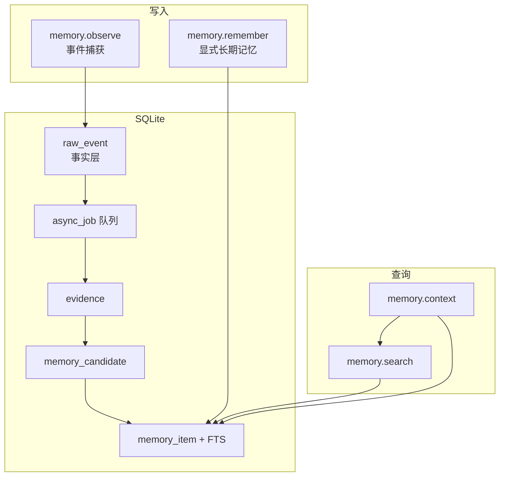
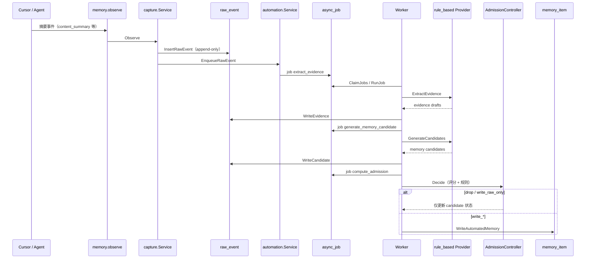

# The One

> 最终目标，我是另外一个你。

The One 是一个本地优先的 AI Memory Runtime。它试图回答一个问题：如果 AI Agent 要长期陪你写代码、做设计、查问题、复盘决策，它应该怎样逐渐理解“你”？

这里的“另一个你”不是人格复制，也不是让 AI 替代用户做判断。它指的是一个长期、可追溯、可纠正的记忆系统：能记住你的项目背景、技术偏好、架构原则、历史决策、踩坑经验和学习轨迹，并在新的任务里把这些记忆变成有用的上下文。

## 为什么需要它

今天的 AI Coding Agent 很强，但它大多活在当前会话里。换一个会话、换一个项目、换一个工具，用户就要重新解释：

- 这个项目为什么这样设计。
- 你偏好什么样的代码风格、测试方式和评审方式。
- 哪些技术路线曾经试过，为什么放弃。
- 哪些 bug 曾经踩过，根因是什么。
- 哪些安全边界、团队规范和部署约束不能碰。
- 你在哪些技术方向上正在学习、反复卡住或逐渐变强。

The One 希望把这些长期状态沉淀下来，让 AI 不只是“会回答问题”，而是能在证据允许的范围内越来越像你的长期工程搭档。

## 它要记住什么

The One 不追求保存所有聊天记录。它关注的是长期有价值、可复用、可治理的记忆。

典型记忆包括：

- 用户偏好：代码风格、沟通方式、测试倾向、架构表达方式。
- 项目事实：技术栈、模块边界、目录约定、部署环境。
- 架构决策：为什么选择某个方案，为什么放弃另一个方案。
- 失败经验：历史 bug、性能瓶颈、调试路径、误用工具导致的返工。
- 工作流约束：提交、评审、发布、安全、回滚等流程规则。
- 能力证据：来自真实任务的技术能力信号，而不是无证据评价。

这些记忆的目标不是“多”，而是“准、可查、可删、可解释”。

## 设计思路

The One 的核心不是“聊天历史 + 向量库”，而是 Memory Lifecycle Control。

一条记忆从出现到被遗忘，会经过完整生命周期：

```text
AI 工具事件
  -> 记忆准入控制
  -> 结构化编码
  -> 分层存储
  -> 混合召回
  -> 上下文预算注入
  -> 使用反馈
  -> 巩固 / 衰减 / 归档 / 删除 / 画像更新
```

这意味着：

- 不是所有内容都该被记住。
- 原始聊天不等于长期记忆。
- 被召回不等于应该注入上下文。
- 被使用过不等于一定正确。
- 删除不能只从一张表里删掉就宣称“遗忘”。
- 能力画像必须来自证据，不能从一次闲聊里推断人格或水平。

## 核心原则

- Context window 是工作区，不是长期记忆库。
- 稳定记忆必须保留来源，能够追溯到 episode 或 event。
- 写入要经过准入、编码、去重、冲突检测和生命周期治理。
- 检索不是一次 Top-K，而是关键词、实体、标签、项目范围、时间和关系的多路召回。
- `embedding=none` 时系统仍必须可用。
- 敏感记忆默认不自动注入上下文。
- 记忆不能被提升为 system prompt，避免持久化 Prompt Injection。
- 删除要覆盖主表、索引、缓存、导出和备份边界。
- 用户画像必须 evidence-based，不做心理、人格或价值观推断。

## 系统架构

The One 在存储上分为**事实层**（`raw_event`）与**记忆层**（`memory_item`），在写入上分为**显式写入**（`memory.remember`）与**事件捕获 + 异步管道**（`memory.observe` → P3）。

### 总体数据流



| 层级 | 主要表 | 作用 |
|------|--------|------|
| 事实层 | `agent_session`、`agent_task`、`raw_event` | 会话/任务边界与最小化事件流水（可审计、可去重） |
| 记忆层 | `memory_item`、`evidence`、`memory_evidence_link`、FTS | 可检索的长期/中期记忆 |
| 自动化 | `async_job`、`memory_candidate` | 从事件抽证据 → 候选 → 准入 → 写入记忆 |

`memory.observe` 同步返回时 `pipeline` 为 `raw_event_only`：**单次 observe 不直接写 `memory_item`**，但会入队由规则引擎抽取并经准入后写入。`memory.remember` 同步走同一准入控制器，未通过则返回 `ADMISSION_REJECTED`。

### 事件捕获 → async_job → memory_item（P3 自动管道）

前提：`serve` 模式下后台 Worker 始终轮询执行任务；`processor.provider` 仅允许 `rule_based`，observe 与 remember 均经同一套准入规则决定是否写入 `memory_item`。



三步 job 类型（`internal/automation/types.go`）：

| 顺序 | `job_type` | `target` | 作用 |
|------|------------|----------|------|
| 1 | `extract_evidence` | `raw_event` | 规则引擎从事件抽 `evidence`（低信号事件可能跳过） |
| 2 | `generate_memory_candidate` | `evidence` | 生成 `memory_candidate` 草稿 |
| 3 | `compute_admission` | `memory_candidate` | 准入评分；通过则写入 `memory_item`，否则 `dropped` |

准入决策示例：`drop`、`write_raw_only`（不建记忆）、`write_temporary` / `write_provisional` / `write_pending_review` / `write_stable`。高影响类型（如架构决策）常进入 `pending_review`，需 `memory.review` 确认后变为 `stable`。

规则引擎（`processor.rule_based`）会过滤多数普通对话与成功工具输出；用户声明、纠正、失败工具、含「记住/约束」等信号的消息更易进入候选。

### Cursor 侧写入说明

- **IDE 不会自动写库**：需配置 MCP，并由 Agent 按 Rules 调用 `memory_observe` / `memory_remember`。
- **每条用户消息** → 通常只进 `raw_event`；是否晋升为 `memory_item` 取决于 P3 过滤与准入，或 Agent 显式 `memory.remember`。
- 详见 `doc/Cursor 适配与安装后配置说明.md`。

## v1.0.0 本地 


### 构建和启动

```bash
make build
bin/theone serve --data-dir /tmp/theone
```

默认日志会同时输出到终端 stderr 和 `~/.theone/logs/theone.log`。如需自定义路径，可在 `theone.yaml` 中设置 `logging.path`，或通过环境变量 `THEONE_LOG_PATH` 覆盖。服务启动时还会把当前进程号写入 `~/.theone/theone.pid`，重启后会自动覆盖为新的 PID。

健康检查：

```bash
make run-health DATA_DIR=/tmp/theone
make run-status DATA_DIR=/tmp/theone
```

### Agent 接入

The One 当前作为本地 `stdio` MCP server 运行，适合被 Codex、Cursor、Claude Code 这类 Agent 以子进程方式拉起。接入前建议先完成编译：

```bash
make build
```

#### Codex

在 `~/.codex/config.toml` 中增加：

```toml
[mcp_servers.theone]
command = "/Users/zaneway/SynologyDrive/code-space/GolandProjects/the-one/bin/theone"
args = [
  "serve",
  "--config",
  "/Users/zaneway/SynologyDrive/code-space/GolandProjects/the-one/theone.yaml"
]
cwd = "/Users/zaneway/SynologyDrive/code-space/GolandProjects/the-one"
startup_timeout_sec = 20
tool_timeout_sec = 120
enabled = true
required = false
```

如果希望显式指定数据目录，可把 `args` 改成：

```toml
args = [
  "serve",
  "--config",
  "/Users/zaneway/SynologyDrive/code-space/GolandProjects/the-one/theone.yaml",
  "--data-dir",
  "/Users/zaneway/.theone"
]
```

#### Cursor

推荐在项目根目录创建 `.cursor/mcp.json`：

```json
{
  "mcpServers": {
    "theone": {
      "command": "/Users/zaneway/SynologyDrive/code-space/GolandProjects/the-one/bin/theone",
      "args": [
        "serve",
        "--config",
        "/Users/zaneway/SynologyDrive/code-space/GolandProjects/the-one/theone.yaml"
      ],
      "env": {}
    }
  }
}
```

如果希望所有项目都能复用，也可以放到全局 `~/.cursor/mcp.json`。项目级配置优先级高于全局配置。

#### Claude Code

Claude Code 推荐直接通过 CLI 注册本地 stdio MCP server：

```bash
claude mcp add --transport stdio theone -- \
  /Users/zaneway/SynologyDrive/code-space/GolandProjects/the-one/bin/theone \
  serve \
  --config /Users/zaneway/SynologyDrive/code-space/GolandProjects/the-one/theone.yaml
```

如果需要显式指定数据目录：

```bash
claude mcp add --transport stdio theone -- \
  /Users/zaneway/SynologyDrive/code-space/GolandProjects/the-one/bin/theone \
  serve \
  --config /Users/zaneway/SynologyDrive/code-space/GolandProjects/the-one/theone.yaml \
  --data-dir /Users/zaneway/.theone
```

如果你希望把配置跟项目一起管理，也可以在项目根目录维护 `.mcp.json`，典型内容如下：

```json
{
  "mcpServers": {
    "theone": {
      "type": "stdio",
      "command": "/Users/zaneway/SynologyDrive/code-space/GolandProjects/the-one/bin/theone",
      "args": [
        "serve",
        "--config",
        "/Users/zaneway/SynologyDrive/code-space/GolandProjects/the-one/theone.yaml"
      ],
      "env": {}
    }
  }
}
```

#### 验证接入是否成功

任一 Agent 接好后，都可以优先验证以下几点：

- 能看到 `theone` 暴露的 MCP tools。
- 能成功调用 `memory.health` 或 `memory.status`。
- 本地生成或更新 `~/.theone/theone.pid`。
- 日志文件 `~/.theone/logs/theone.log` 中出现启动记录。

### 验收

```bash
go test ./...
go test -tags sqlite_fts5 ./...
make test-p2-capture
make test-p3-sqlite
make test-p4-retrieval
make test-p5-mvp
```

P5 synthetic 验收只验证 Engine MVP，不启动真实 Agent。三 Agent 真实环境手工验收已于 **2026-05-27** 在本地完成（清单与步骤见 `examples/agents/shared-theone/README.md`）。**Level4 全量捕获**（六能力齐套）依赖各 Agent 侧 Rules/Adapter/hooks，列入后续版本完善，不阻塞 v1.0.0。


### 当前限制

- `sqlite-vec` / vector retrieval 不是默认必需能力。
- Code Index 默认是 `local_basic`，不提供完整跨语言调用图。
- 不实现在线 LLM rerank。
- 不包含团队权限、企业审计、备份恢复。
- 不保存完整源码、完整工具输出、完整 diff、完整历史对话。
- token savings 是本地近似估算口径。
- Level4 全量捕获依赖各 Agent 侧配置，v1.0.0 后置完善（核心 MCP 与记忆链路已本地验收）。

## 展望

计划中的增强项与已知局限见 [doc/后续完善规划.md](doc/后续完善规划.md)（含基于大模型的记忆价值判断、多厂商模型对接等）。

The One 的长期愿景是成为一个个人与团队都能使用的认知状态层。

第一步，它是本地个人记忆 runtime：让 AI Agent 记住你的偏好、项目和经验。

第二步，它会有可视化管理能力：你可以审查记忆来源、确认或驳回画像证据、归档低价值记忆、删除敏感记忆，并看到一次删除影响了哪些存储、索引和缓存。

第三步，它可以扩展为团队工程规范助手：沉淀团队架构原则、评审偏好、发布流程、安全禁区和项目约定，并在多用户、多项目、多设备之间保持权限隔离和审计。

更远期，它可以支持学习复盘：不是泛泛地推荐课程，而是基于真实任务中的 evidence，告诉你哪些能力在增强，哪些问题反复依赖 AI，哪些主题值得复习，哪些失败模式正在重复出现。

最终目标不是让 AI 自称理解你，而是让每一次理解都有证据、每一次错误都能纠正、每一条记忆都能被审查和删除。
