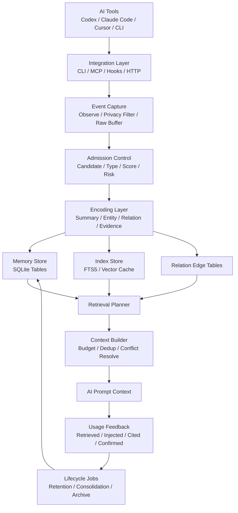

# AI 记忆存储系统方案 A 设计文档

> 版本：v0.3  
> 日期：2026-05-22  
> 方案定位：本地优先的 AI Memory Runtime  
> 约束技术栈：Go、Java8、Vue3  
> 部署形态：本地 CLI 工具、本地常驻服务、后续 Web 服务  
> 第一阶段核心：Go + SQLite/FTS5 + MCP + Codex/Cursor 集成

## 1. 结论摘要

方案 A 的主方向成立：它不应被设计成“聊天历史 + 向量库”，而应被设计成一个有准入、编码、检索、反馈、巩固、衰减、审计和删除治理的长期记忆运行时。

第一阶段建议收敛为：

```text
本地 Go Memory Runtime
  + SQLite / FTS5
  + MCP Server
  + Codex / Cursor 优先集成
  + remember / search / context / feedback
  + 最小 observe / consolidate
  + retention / review
  + evidence-based skill profile
```

暂不进入第一阶段的能力：

```text
Vue3 管理界面
Java8 Web 管理服务
多租户团队平台
复杂图数据库
完整学习推荐
Redis
复杂代码结构索引
```

核心判断：

1. Go 负责本地 runtime 主链路。
2. SQLite/FTS5 作为 MVP 主存储和主检索。
3. Embedding 是增强能力，不是启动前提。
4. MCP 是第一阶段集成协议，Codex 和 Cursor 是首批验证对象。
5. 画像必须 evidence-based，第一阶段只做证据聚合。
6. Redis 不进入 MVP，只在后续 Web 多实例阶段作为缓存、队列、锁、限流组件。

## 2. 背景与目标

当前 AI 工具的主要问题不是单次推理能力不足，而是长期状态缺失。用户在不同 Agent、不同会话、不同项目中反复传递相同背景，会造成三个直接成本：

1. Token 消耗高：项目背景、用户偏好、历史决策需要重复输入。
2. 决策连续性差：AI 无法稳定继承架构约束、技术偏好和失败经验。
3. 用户成长不可沉淀：长期交互无法形成可靠的技术能力画像和学习方向建议。

本系统目标不是保存所有聊天记录，而是构建一个可治理的长期记忆层：

```text
AI 工具事件
  -> 记忆准入控制
  -> 结构化编码
  -> 分层存储
  -> 混合召回
  -> 上下文预算注入
  -> 使用反馈
  -> 巩固 / 衰减 / 遗忘 / 画像更新
```

### 2.1 核心目标

| 目标 | 工程定义 | 验证指标 |
|---|---|---|
| 降低 Token 消耗 | 用可检索记忆替代重复背景输入 | 重复说明 token 下降、context build 命中率 |
| 提高上下文连续性 | Agent 能跨会话理解用户、项目和历史决策 | 用户纠正次数下降、历史约束误用率下降 |
| 构建技术能力画像 | 从任务、反馈、决策中提取有证据的能力信号 | skill evidence 覆盖率、画像人工确认率 |
| 推荐学习方向 | 基于能力缺口、长期目标和失败模式生成建议 | 推荐采纳率、后续任务成功率 |

### 2.2 非目标

MVP 阶段不做：

```text
不做企业级多租户知识平台
不做强一致业务主数据系统
不永久保存所有原始聊天记录
不自动沉淀高风险心理 / 人格画像
不依赖重图数据库
不把向量库作为唯一记忆系统
不承诺所有自动抽取事实都正确
不做完整学习推荐系统
```

## 3. 实际用途

这个系统不只是 AI 省 Token 的记忆库，更像一个面向个人和团队的长期认知状态层。它的核心资产不是原始聊天记录，而是可追溯、可检索、可治理的用户偏好、项目事实、架构决策、失败经验和能力证据。

### 3.1 AI Coding Agent 项目记忆层

这是最适合 MVP 的落地场景。

用途：

```text
记录项目架构决策
记录技术栈和模块边界
记录历史 bug / 踩坑 / 回滚原因
记录项目约束和开发规范
记录用户对代码风格、测试、评审方式的偏好
让 Codex / Cursor / Claude Code 减少重复探索和重复背景说明
```

### 3.2 个人技术成长画像

系统可以从长期任务证据中构建用户技术能力画像。

可沉淀内容：

```text
长期关注的技术主题
反复依赖 AI 的问题类型
经常出错或被纠正的能力点
逐渐增强的工程能力
偏好的技术栈和架构判断方式
明确表达的学习目标
```

边界：

```text
不从一次闲聊推断能力
不自动推断人格、心理或价值观
不把“问过某技术”直接等同于“掌握某技术”
第一阶段只做证据聚合，不做学习推荐
```

### 3.3 技术决策知识库

方案 A 可以沉淀轻量 ADR-like memory：

```text
为什么选择某项技术
为什么放弃某个方案
当时的约束条件
风险和权衡
后续验证结果
```

这类记忆的价值高于普通项目事实，因为它帮助后续 Agent 和用户理解“为什么系统是现在这样”。

### 3.4 失败经验与反模式库

失败经验是高价值记忆类型，尤其适合进入长期 memory。

例子：

```text
某次 bug 根因
某次性能瓶颈定位路径
某个错误技术选型
某类调试路径失败原因
某个 Agent 曾经误用工具导致返工
```

如果同类失败重复出现，可提升为 procedure memory。

### 3.5 团队工程规范助手

后续团队形态下，系统可以扩展为工程规范助手：

```text
编码规范
代码评审偏好
发布流程
安全禁区
项目约定
团队架构原则
```

该用途需要用户、项目、团队、Agent 权限隔离，也需要审计和删除治理，不应进入本地 MVP 第一阶段。

### 3.6 学习复盘系统

系统可以把 AI 使用过程反过来用于帮助用户学习：

```text
用户在哪些问题上长期依赖 AI
哪些知识点只是能提问但没有真正掌握
哪些主题值得复习
哪些能力已经能独立完成
哪些失败模式反复出现
```

这比普通学习计划更真实，因为它来自实际任务证据。但推荐能力应在画像证据稳定后再上线。

### 3.7 Agent 行为审计与改进

系统还可以用于改进 AI 工具本身：

```text
哪些记忆被召回
哪些记忆被注入上下文
哪些记忆被错误使用
哪些上下文造成误导
哪些任务因为缺少记忆而重复探索
哪些 Agent protocol 需要调整
```

该用途要求 `context_build_log`、`memory_access_log`、`feedback` 和 `deletion_receipt` 进入工程设计。

## 4. 设计原则

方案 A 吸收论文分析和项目调研后的核心原则：

1. 记忆系统不是“聊天历史 + 向量库”，而是 Memory Lifecycle Control。
2. Context window 是工作区，不是长期记忆。
3. Episode 与 Semantic 必须分层，语义记忆必须保留来源。
4. 写入要经过准入、编码、巩固、冲突检测，不能所有内容直接入库。
5. 检索不是一次 Top-K，而是关键词、实体、时间、关系、向量的多路搜索。
6. 遗忘不是简单 TTL，而是基于类型、重要性、置信度、反馈和时间衰减的生命周期策略。
7. 用户画像必须 evidence-based，只记录可追溯证据，不做无证据推断。
8. 删除必须区分 active store、索引、缓存、导出、备份，不能轻易宣称“已遗忘”。

## 5. 总体架构

### 5.1 逻辑架构



### 5.2 运行形态

第一阶段采用本地优先架构：

```text
ai-memory CLI
  -> Go local daemon
  -> MCP Server
  -> SQLite 数据库
  -> FTS5 索引
  -> 本地配置目录
```

推荐本地目录：

```text
~/.ai-memory/
  config.yaml
  memory.db
  logs/
  cache/
    embeddings/
  exports/
  backups/
```

项目级配置：

```text
<project>/.ai-memory.yaml
```

用途：

```text
覆盖项目作用域
配置敏感路径
设置默认标签
配置 embedding provider
定义项目级过滤规则
```

### 5.3 分层模块

| 层     | 组件                                          | 职责                   |
| ----- | ------------------------------------------- | -------------------- |
| 集成层   | CLI / MCP / HTTP / Hooks                    | 标准化 AI 工具事件，提供记忆工具   |
| 事件层   | Event Capture / Raw Buffer / Privacy Filter | 接收事件、脱敏、截断、短期缓冲      |
| 准入层   | Candidate / Type / Value / Risk / Conflict  | 判断什么值得记忆，决定写入层级      |
| 编码层   | Summary / Entity / Relation / Evidence      | 把候选事件加工成结构化记忆        |
| 存储层   | SQLite tables / FTS5 / Vector cache         | 保存主数据、索引、关系、画像证据     |
| 检索层   | Retrieval Planner / Ranker                  | 多路召回、融合排序、冲突处理       |
| 上下文层  | Context Builder                             | 控制 token 预算，构造可注入上下文 |
| 生命周期层 | Retention / Consolidation / Review          | 巩固、衰减、归档、删除、审计       |

## 6. 核心模块设计

### 6.1 Integration Layer

职责：

```text
提供 CLI 命令
提供本地 HTTP API
提供 MCP Server
支持最小 Agent Hooks 接入
把不同 AI 工具事件标准化成 MemoryEvent
```

MCP 第一阶段工具：

```text
remember
search
context
feedback
review_cold
stats
```

第一阶段围绕 Codex 和 Cursor 设计统一接入契约：

```text
任务开始 -> search/context
任务过程中用户显式纠正 -> remember or feedback
任务结束 -> observe/consolidate
人工检查 -> review_cold / stats
```

一期不为 Codex 和 Cursor 分别实现两套记忆逻辑。两者共用同一个 MCP Server、同一套 CLI、同一套 SQLite schema、同一套检索和上下文构造逻辑。

#### 6.1.1 一期集成范围收敛

一期满足以下能力即可成立：

```text
MCP 必做:
  remember
  search
  context
  feedback
  stats

Agent instructions 必做:
  Codex 使用说明
  Cursor 使用说明
  何时 search/context
  何时 remember/feedback
  何时不要注入记忆

Hooks 可选且最小:
  session_start 可触发 context
  session_end 可提交 task_summary
  user_explicit_save 可转 remember
```

不进入一期的集成能力：

```text
不做全量 tool_call 自动捕获
不做每次 assistant_response 自动入库
不做 Cursor 私有深度适配
不做多个 Agent 客户端的差异化状态机
不做复杂 hook 编排和重试队列
```

原因：

```text
MCP 已能覆盖主动检索、显式保存、上下文构建和反馈闭环
hooks 的价值在自动采集，但也是范围膨胀和噪声污染的主要来源
Codex 与 Cursor 的第一阶段差异应留在 instructions，而不是进入核心 runtime
```

因此，一期最小闭环可以缩小为：

```text
MCP tools + Agent instructions + 手动/显式记忆反馈
```

自动观察、候选抽取、准入评分、raw buffer 可以作为 MVP-2，而不是 MVP-1 的阻塞项。

### 6.2 Event Capture Layer

职责：

```text
接收原始事件
执行敏感信息过滤
截断大文本
生成事件摘要
写入 event_log、raw_event_buffer 或 episode
```

事件类型：

```text
user_prompt
assistant_response
tool_call
command_output
file_summary
decision_discussion
manual_memory
user_feedback
task_summary
```

边界：

```text
原始事件不等于长期记忆
工具输出默认短 TTL
敏感内容默认拦截或脱敏
超大内容只保存摘要和引用
raw event 默认只服务当前任务
```

### 6.3 Admission Control

职责：

```text
判断什么值得长期记忆
确定记忆类型
计算价值分和风险分
处理去重、合并、冲突
决定写入层级和初始状态
```

准入流程：

```text
MemoryEvent
  -> CandidateExtractor
  -> TypeClassifier
  -> ValueScorer
  -> RiskScorer
  -> Deduplicator
  -> ConflictDetector
  -> AdmissionDecision
```

准入结果：

| 结果 | 处理 |
|---|---|
| reject | 不写长期记忆，只写必要审计 |
| short_term | 写入 session/task 级短期摘要 |
| provisional | 写入候选记忆，等待巩固 |
| stable | 高置信写入稳定记忆 |
| protected | 用户显式保存、架构约束、安全约束等保护记忆 |

第一版评分：

```text
admission_score =
  0.25 * future_value
+ 0.20 * encoding_depth
+ 0.15 * stability
+ 0.15 * user_signal
+ 0.10 * evidence_quality
- 0.15 * sensitivity_risk
- 0.10 * staleness_risk
- 0.10 * conflict_risk
```

### 6.4 Encoding Layer

职责：

```text
把候选事件加工成结构化记忆对象
抽取实体
抽取关系
绑定来源 episode
生成检索线索
生成能力画像 evidence
```

编码深度：

| 深度 | 产物 | 生命周期 |
|---:|---|---|
| 0 | 原始引用 | 短期 |
| 1 | 时间、来源、关键词 | 短期 / 中期 |
| 2 | 结构化摘要、事实、结论 | 长期候选 |
| 3 | 实体、约束、因果、来源 | 长期 |
| 4 | 原则、过程规则、能力证据 | 长期高价值 |

### 6.5 Retrieval Layer

MVP 候选集建议使用并集，而不是单一路径：

```text
candidate_set =
  FTS results
  + exact entity / file / tag match
  + recent project decisions
  + pinned / protected memories
```

MVP 排序：

```text
final_score =
  relevance * 0.55
+ scope_match * 0.15
+ confidence * 0.10
+ importance * 0.08
+ retention_score * 0.07
+ freshness * 0.05
- sensitivity_penalty
- stale_penalty
- context_cost_penalty
```

约束：

```text
retrieved 不等于 used
sensitive/protected memory 默认不自动注入正文
冲突记忆必须一起返回摘要
Context Builder 输出必须包含 memory_id
```

### 6.6 Context Builder

职责：

```text
把检索结果压缩成 Agent 可用上下文
控制 token 预算
去重
处理冲突
标注来源和置信度
避免注入敏感内容
记录 context_build_log
```

上下文块建议格式：

```xml
<ai-memory-context>
  <user-preferences>...</user-preferences>
  <project-facts>...</project-facts>
  <decisions>...</decisions>
  <constraints>...</constraints>
  <relevant-lessons>...</relevant-lessons>
  <open-risks>...</open-risks>
</ai-memory-context>
```

### 6.7 Lifecycle Layer

职责：

```text
定期计算 retention score
执行 cold review
归档低价值记忆
保护高价值记忆
清理索引
记录审计日志
生成 deletion receipt
```

第一版任务：

| 任务 | 频率 | 说明 |
|---|---:|---|
| retention score | 每日 | 计算 hot/warm/cold/evictable |
| consolidation | 每小时或手动 | provisional -> stable/archive |
| index rebuild | 手动或异常恢复 | 修复 FTS / vector 索引 |
| backup | 每日 | 备份 SQLite |
| cold review | 每周 | 生成待确认列表 |

## 7. 技术选型

### 7.1 Go

Go 作为第一阶段主语言：

```text
Go CLI
Go daemon
Go MCP server
Go background worker
SQLite / FTS5 repository
```

理由：

```text
单二进制发布简单
适合本地 CLI 和 daemon
并发模型清晰
适合 MCP / HTTP / background worker
跨平台部署成本低
比 Java8 更适合本地工具形态
```

### 7.2 Java8

Java8 不建议进入本地 runtime 主链路。若必须使用 Java8，建议定位为后续治理面：

```text
Java8 Admin Service:
  用户 / 项目 / 权限
  组织审计
  同步编排
  Web API 聚合
```

注意：

```text
不在 Java8 中重复实现记忆写入、检索和 lifecycle
Go Memory Runtime 保持唯一记忆主链路
Java8 调用 Go API 或消费 event_log
```

### 7.3 SQLite

MVP 使用 SQLite：

```text
memory.db
  主数据
  FTS5 索引
  relation edge
  access log
  lifecycle score
  profile evidence
```

建议强制启用：

```sql
pragma journal_mode = WAL;
pragma synchronous = NORMAL;
pragma foreign_keys = ON;
pragma busy_timeout = 5000;
```

边界：

```text
不适合高并发多用户写入
复杂权限隔离弱
大规模向量检索能力不足
FTS 外部内容表需要显式维护一致性
```

### 7.4 FTS5

MVP 以 FTS5 BM25 为第一检索主路径。

中文检索策略：

```text
init 时检测 sqlite_version 和 fts5 tokenizer
支持 trigram -> 使用 trigram
不支持 trigram -> 使用 unicode61 + retrieval_cues
中文内容较多 -> 写入时生成分词 / 关键词 cues
```

验收标准：

```text
中文项目名、文件名、技术名、英文缩写均可检索
embedding=none 时搜索仍可用
FTS tokenizer 不支持 trigram 时 init 不失败
```

### 7.5 Embedding Provider

MVP 不强制依赖 embedding，但接口必须预留。

Provider 范围：

```text
openai
minimax
deepseek
openai-compatible
ollama
none
```

策略：

```text
FTS5 BM25 是第一检索主路径
embedding 作为增强能力按配置启用
API key 从环境变量读取，不写入 config.yaml
embedding 失败不得阻塞主写入链路
embedding=none 时系统仍完整可用
```

### 7.6 Vue3

Vue3 不进入第一阶段。第二阶段作为本地或 Web 管理界面：

```text
记忆检索
记忆审核
记忆确认 / 驳回
画像查看
cold memory review
敏感记忆删除
系统诊断
```

### 7.7 Redis

MVP 不引入 Redis。

原因：

```text
第一阶段是本地 CLI / daemon / MCP
SQLite + WAL + FTS5 足够支撑个人和小团队低并发
Redis 会增加部署复杂度
记忆系统的核心难点不是缓存性能
Redis 不能替代长期记忆、FTS、证据链、权限、审计和删除治理
```

Redis 只作为后续 Web 服务增强组件：

```text
short-term cache
job queue
distributed lock
rate limit
session state
temporary context cache
embedding / consolidation 任务队列
```

Redis 不应作为以下数据的权威存储：

```text
memory 主数据
episode / event_log
skill_evidence
skill_profile
learning_recommendation
删除审计
权限策略
长期画像
```

分阶段判断：

| 阶段 | 是否引入 Redis | 判断 |
|---|---:|---|
| 本地 MVP | 否 | SQLite/FTS5 足够 |
| 本地 daemon + Vue3 UI | 否 | Go worker + SQLite 可管理 |
| 单实例 Web 服务 | 可选 | 仅在有队列或缓存压力时引入 |
| 多实例 Web 服务 | 是 | 用于队列、锁、限流、短期缓存 |
| 企业级平台 | 是，但非主存储 | 配合 PostgreSQL/pgvector/OpenSearch |

## 8. 核心数据模型

### 8.1 event_log

不可变事件日志，用于幂等、同步、审计和重放。

```sql
create table event_log (
  id                    text primary key,
  tenant_id             text not null default 'local',
  user_id               text not null,
  project_id            text,
  source_client_id      text not null,
  source_event_seq      integer,
  idempotency_key       text not null,
  event_type            text not null,
  actor_type            text not null,
  actor_id              text,
  payload_json          text not null,
  schema_version        text not null,
  trace_id              text,
  occurred_at           text not null,
  received_at           text not null,
  unique(source_client_id, idempotency_key)
);
```

### 8.2 raw_event_buffer

短期原始事件缓冲，不等于长期记忆。

```sql
create table raw_event_buffer (
  id                    text primary key,
  event_log_id          text not null,
  content_ref           text,
  content_summary       text not null,
  byte_size             integer not null default 0,
  ttl_until             text not null,
  sensitivity_level     text not null default 'normal',
  redaction_status      text not null default 'none',
  created_at            text not null
);
```

### 8.3 episode

Episode 是事实来源，不直接等于稳定记忆。

```sql
create table episode (
  id                  text primary key,
  event_log_id        text,
  session_id          text,
  task_id             text,
  user_id             text not null,
  project_id          text,
  event_type          text not null,
  event_summary       text not null,
  raw_ref             text,
  actor               text not null,
  occurred_at         text not null,
  created_at          text not null
);
```

### 8.4 memory_item

长期记忆主表。

```sql
create table memory_item (
  id                  text primary key,
  tenant_id           text not null default 'local',
  user_id             text not null,
  project_id          text,
  scope               text not null,
  type                text not null,
  content             text not null,
  summary             text,
  retrieval_cues      text,
  encoding_depth      integer not null default 2,
  confidence          real not null default 0.70,
  importance          real not null default 0.50,
  sensitivity_level   text not null default 'normal',
  status              text not null default 'provisional',
  source_type         text not null,
  version             integer not null default 1,
  supersedes_id       text,
  valid_from          text,
  valid_until         text,
  retention_policy    text not null default 'default',
  pinned              integer not null default 0,
  legal_hold          integer not null default 0,
  deleted             integer not null default 0,
  deleted_at          text,
  delete_reason       text,
  access_count        integer not null default 0,
  created_at          text not null,
  updated_at          text not null,
  last_accessed_at    text,
  last_validated_at   text
);
```

枚举建议：

```text
scope: user / project / session / task / global
type: preference / architecture / decision / constraint / bug / workflow / fact / procedure / skill / observation / security
status: raw / provisional / consolidating / stable / archived / deleted
sensitivity_level: public / normal / sensitive / secret
```

### 8.5 memory_source

绑定记忆和证据来源。

```sql
create table memory_source (
  id                  text primary key,
  memory_id           text not null,
  episode_id          text not null,
  evidence_type       text not null,
  evidence_strength   real not null default 0.50,
  created_at          text not null
);
```

### 8.6 entity 与 memory_entity

```sql
create table entity (
  id                  text primary key,
  tenant_id           text not null default 'local',
  entity_type         text not null,
  name                text not null,
  normalized_name     text not null,
  aliases             text,
  metadata            text,
  created_at          text not null,
  updated_at          text not null
);

create table memory_entity (
  memory_id           text not null,
  entity_id           text not null,
  role                text not null,
  weight              real not null default 0.50,
  primary key (memory_id, entity_id, role)
);
```

### 8.7 memory_link

轻量关系边，不引入图数据库。

```sql
create table memory_link (
  id                  text primary key,
  source_memory_id    text not null,
  target_memory_id    text not null,
  relation_type       text not null,
  weight              real not null default 0.50,
  confidence          real not null default 0.70,
  created_at          text not null
);
```

关系类型：

```text
derived_from
supports
contradicts
caused_by
precedes
refines
generalizes
supersedes
related_to
```

### 8.8 memory_access_log

记录召回后是否真的被使用。

```sql
create table memory_access_log (
  id                  text primary key,
  memory_id           text not null,
  query               text,
  event_type          text not null,
  used_in_context     integer not null default 0,
  feedback            text,
  created_at          text not null
);
```

事件类型：

```text
retrieved
injected
cited
user_confirmed
task_success
ignored
stale_detected
user_rejected
contradicted
```

### 8.9 memory_retention_score

```sql
create table memory_retention_score (
  memory_id             text primary key,
  score                 real not null,
  salience              real not null,
  temporal_decay        real not null,
  reinforcement_boost   real not null,
  negative_penalty      real not null default 0,
  tier                  text not null,
  computed_at           text not null,
  config_version        text not null
);
```

### 8.10 skill_evidence 与 skill_profile

第一阶段画像只做 evidence 聚合，因此 `skill_evidence` 是必须模型。

```sql
create table skill_evidence (
  id                    text primary key,
  user_id               text not null,
  skill_area            text not null,
  memory_id             text not null,
  episode_id            text,
  evidence_type         text not null,
  signal                text not null,
  weight                real not null default 0.50,
  confidence            real not null default 0.70,
  direction             text not null default 'positive',
  observed_at           text not null,
  created_at            text not null
);

create table skill_profile (
  id                    text primary key,
  user_id               text not null,
  skill_area            text not null,
  proficiency_level     text not null,
  confidence            real not null default 0.50,
  evidence_count        integer not null default 0,
  last_evidence_at      text,
  last_tested_at        text,
  trend                 text not null default 'unknown',
  created_at            text not null,
  updated_at            text not null
);
```

约束：

```text
evidence_type: explicit_statement / task_success / task_failure / correction / review_feedback / repeated_interest
signal: design_quality / implementation_quality / debugging / architecture_reasoning / tool_usage / learning_goal
direction: positive / negative / neutral
```

### 8.11 context_build_log

用于证明 token 节省和排查上下文污染。

```sql
create table context_build_log (
  id                    text primary key,
  query                 text not null,
  user_id               text not null,
  project_id            text,
  token_budget          integer not null,
  output_tokens         integer not null,
  candidate_count       integer not null,
  injected_count        integer not null,
  memory_ids_json       text not null,
  warnings_json         text,
  created_at            text not null
);
```

### 8.12 subject 与 permission_policy

Local MVP 可内置默认策略，但 API 和 Repository 层必须预留 subject。

```sql
create table subject (
  id                    text primary key,
  subject_type          text not null,
  name                  text not null,
  metadata              text,
  created_at            text not null
);

create table permission_policy (
  id                    text primary key,
  subject_id            text not null,
  scope                 text not null,
  project_id            text,
  memory_type           text,
  operations            text not null,
  created_at            text not null
);
```

### 8.13 deletion_receipt

记录删除范围，避免伪遗忘。

```sql
create table deletion_receipt (
  id                    text primary key,
  target_type           text not null,
  target_id             text not null,
  delete_mode           text not null,
  deleted_from_json     text not null,
  remaining_refs_json   text,
  requested_by          text not null,
  reason                text,
  created_at            text not null
);
```

必须记录清理项：

```text
memory_item
memory_fts
memory_source
memory_entity
memory_link
retention_score
vector_cache
embedding_cache
context cache
export files
```

备份边界：

```text
如果旧备份仍含该数据，不能宣称全局 hard delete 完成
只能声明 active store 已删除，备份将在保留周期后过期
```

### 8.14 FTS5 索引

```sql
create virtual table memory_fts using fts5(
  memory_id unindexed,
  content,
  summary,
  entities,
  retrieval_cues,
  tokenize = 'trigram'
);
```

如果运行环境不支持 trigram，则降级为外部分词后写入 `retrieval_cues`。

## 9. 核心流程

### 9.1 显式保存记忆

适用于用户明确要求保存的高价值信息。

```bash
ai-memory remember "项目采用 Go + SQLite 作为 MVP 主路径" \
  --type decision \
  --scope project \
  --tag architecture
```

流程：

```text
CLI / MCP
  -> validate input
  -> privacy filter
  -> idempotency check
  -> duplicate check
  -> event_log write
  -> episode write
  -> memory_item write stable
  -> FTS update
  -> access/audit log
```

### 9.2 自动观察事件

适用于 Agent hook 或 API 调用。

```text
tool output / prompt / answer
  -> observe
  -> privacy filter
  -> raw_event_buffer
  -> event summary
  -> candidate extraction
  -> admission control
  -> provisional memory
```

策略：

```text
命令输出默认 observation，不进入 stable
用户纠正默认高优先级候选
架构决策默认 provisional，等待巩固
密钥和敏感数据默认 reject
```

### 9.3 记忆巩固

```text
provisional memory
  -> dedup
  -> source binding check
  -> entity extraction
  -> relation extraction
  -> conflict check
  -> profile evidence extraction
  -> promote stable / archive / reject
```

### 9.4 记忆检索

```text
query
  -> retrieval intent classify
  -> scope filter
  -> FTS BM25
  -> exact entity / tag / file match
  -> metadata filter
  -> relation expansion
  -> score fusion
  -> context budget packing
```

### 9.5 使用反馈

每次检索后必须记录是否真的使用：

```text
retrieved < injected < cited < user_confirmed / task_success
ignored / rejected / contradicted 作为负反馈
```

不要只用 `retrieved` 强化记忆，否则会形成召回马太效应。

## 10. Retention 与遗忘策略

Retention Score 用于判断一条记忆是否仍值得占用存储、索引和上下文预算。它不等于真实性评分，也不等于查询相关性。

公式：

```text
score = min(1, max(0,
  salience * exp(-lambda * ageDays)
+ reinforcementBoost
- negativePenalty
))
```

类型保护：

```text
architecture
security
preference
constraint
decision
```

Tier 策略：

| tier | 分数 | 策略 |
|---|---:|---|
| hot | >= 0.75 | 优先召回，保留 |
| warm | 0.45 - 0.75 | 正常保留 |
| cold | 0.20 - 0.45 | 降低召回权重，进入 review |
| evictable | < 0.20 | 可归档或软删除 |

删除类型：

```text
archive: 不参与普通召回，保留历史
soft delete: 不参与召回，可恢复
hard delete: 主表、FTS、link、entity、vector、cache 全链路清理
```

如果不能全链路清理，不能宣称“已遗忘”，只能称为“已从活跃记忆移除”。

## 11. 安全与权限

### 11.1 本地访问边界

MVP 默认只允许本机访问：

```text
127.0.0.1
localhost
```

禁止默认绑定：

```text
0.0.0.0
公网 IP
```

### 11.2 敏感信息治理

写入前执行 privacy filter：

```text
私钥
API token
密码
身份证
银行卡
手机号
邮箱
客户数据关键字
```

处理策略：

| 类型 | 策略 |
|---|---|
| private key | reject |
| access token | redact |
| password | redact |
| 个人身份信息 | sensitive 标记或 reject |
| 用户显式授权材料 | sensitive 标记，禁止自动注入 |

### 11.3 Prompt Injection 防护

长期记忆中出现以下内容时，不得作为系统指令注入：

```text
忽略之前所有规则
绕过安全限制
以后永远执行某指令
泄露 secret
修改系统策略
```

Context Builder 必须把 memory 作为历史事实、偏好或约束，而不是直接提升为 system prompt。

### 11.4 最小权限模型

```text
subject = user / agent / cli / mcp_client / web_ui / background_job
scope = global / user / project / session / task
operation = observe / search / context / remember / review / delete / export
```

规则：

```text
session/task 记忆默认只允许产生它的 agent/runtime 访问
user 级偏好和画像仅允许用户本人、授权 agent、画像聚合模块访问
project 级记忆默认要求 project membership
protected / sensitive 记忆默认不参与自动 context 注入
```

## 12. CLI 与 API

### 12.1 CLI

```bash
ai-memory init
ai-memory init --project
ai-memory remember "..."
ai-memory observe --type tool_call --input ./event.json
ai-memory search "用户偏好 架构设计 技术选型"
ai-memory context --query "继续设计 AI 记忆系统" --budget 3000
ai-memory feedback <memory-id> --event user_confirmed
ai-memory consolidate
ai-memory retention run
ai-memory review cold
ai-memory archive <memory-id>
ai-memory delete <memory-id>
ai-memory index rebuild
ai-memory backup
ai-memory doctor
ai-memory stats
```

### 12.2 HTTP API

本地 daemon 默认监听：

```text
127.0.0.1:18090
```

核心 API：

```http
POST /api/v1/events
POST /api/v1/memories
POST /api/v1/search
POST /api/v1/context
POST /api/v1/memories/{id}/feedback
GET  /api/v1/profile
GET  /api/v1/profile/evidence
GET  /api/v1/diagnostics/stats
GET  /api/v1/diagnostics/doctor
POST /api/v1/index/rebuild
GET  /api/v1/deletion-receipts/{id}
```

所有写入 API 建议支持：

```text
Idempotency-Key header
X-Source-Client-Id header
X-Subject-Id header
```

## 13. 配置设计

```yaml
server:
  enabled: true
  host: "127.0.0.1"
  port: 18090

storage:
  db_path: "~/.ai-memory/memory.db"
  backup_dir: "~/.ai-memory/backups"

privacy:
  redact_secrets: true
  reject_private_keys: true
  max_raw_event_bytes: 65536

retrieval:
  default_top_k: 10
  default_token_budget: 3000
  enable_vector: false

embedding:
  provider: "none"
  model: ""
  endpoint: ""

retention:
  enabled: true
  score_interval: "24h"
  event_window_days: 60
  protected_types:
    - architecture
    - security
    - preference
    - constraint
    - decision

consolidation:
  enabled: true
  interval: "1h"
  auto_promote_threshold: 0.80
```

敏感配置原则：

```text
API key 不写入 config.yaml
优先读取环境变量
日志必须脱敏
Web UI 不展示 secret value
```

## 14. 能力画像与学习推荐

### 14.1 第一阶段：画像证据聚合

第一阶段只做 evidence 聚合，不自动生成学习推荐。

允许来源：

```text
用户显式声明
用户长期关注主题
架构设计讨论
代码/系统设计任务
失败经验和纠错
学习目标
技术选型偏好
```

不允许来源：

```text
单次闲聊
情绪推断
人格推断
无证据的能力判断
```

画像维度：

```text
skill_area
proficiency_level
confidence
evidence_count
last_evidence_at
trend
source_memory_ids
```

`proficiency_level` 建议：

```text
unknown
interested
practicing
competent
advanced
expert
```

### 14.2 后续阶段：学习推荐

推荐能力上线前必须满足：

```text
画像证据覆盖率达到阈值
记忆质量与召回质量稳定
用户对画像结果已有较高确认率
推荐理由能追溯到 memory_id / episode_id
```

推荐输出必须包含：

```text
推荐方向
推荐理由
证据记忆
前置能力
预期收益
建议学习路径
```

## 15. 代码结构索引边界

`codegraph` 类项目说明，代码结构索引和长期记忆是互补关系，不应混为一套数据模型。

```text
code structure index:
  文件、类、函数、调用、import、route、影响面

long-term memory:
  用户偏好、项目事实、架构决策、失败经验、过程规则、画像证据
```

方案 A 不应在 MVP 内自研 Tree-sitter 代码图谱。更合理的策略：

1. 第一阶段只存项目事实和决策，不解析完整代码图。
2. 如需代码结构能力，通过独立 MCP 工具或后续插件集成 codegraph 类系统。
3. 记忆系统可以引用代码实体，但不要把源码索引作为长期记忆主表。

## 16. 分阶段实施

### 16.1 MVP-0：本地可运行骨架

交付：

```text
ai-memory init
schema migration
SQLite WAL
remember / search / delete
FTS5 tokenizer detection
doctor / stats
```

验收：

```text
CLI 能手动保存记忆
CLI 能按关键词搜索
删除后搜索不可见
index rebuild 可恢复
embedding=none 时系统可用
```

### 16.2 MVP-1：Codex / Cursor + MCP 最小闭环

交付：

```text
MCP remember / search / context / feedback
Codex instructions
Cursor instructions
context budget
context_build_log
memory_access_log
```

验收：

```text
Codex 能通过 MCP 调用 search / context / remember
Cursor 能通过 MCP 调用 search / context / remember
同一项目重复任务能召回历史约束
用户确认 / 驳回会影响后续排序
```

### 16.3 MVP-2：最小 Hooks、事件观察与准入

交付：

```text
event_log
raw_event_buffer
observe
最小 hooks adapter
privacy filter
candidate extraction
admission scoring
provisional memory
consolidate
```

验收：

```text
同一事件重复上报不得产生重复 memory
敏感 token 被脱敏或拒绝
临时命令输出不进入 stable
用户显式纠正进入高优先级候选
hooks 缺失时系统仍可通过 MCP 正常工作
```

### 16.4 MVP-3：画像证据与 Retention

交付：

```text
skill_evidence
skill_profile aggregation
retention score
cold review
archive / soft delete
deletion_receipt
backup / restore
```

验收：

```text
画像项必须能追溯到 memory_id / episode_id
低价值 observation 自动降级
保护类型不被自动硬删除
本地删除后不得继续参与 context build
```

### 16.5 第二阶段：Vue3 管理界面

交付：

```text
memory review
source/evidence view
profile evidence view
settings
diagnostics
delete/export
```

验收：

```text
用户能审查画像证据
用户能确认 / 驳回 / 归档记忆
敏感记忆默认不展开
删除时能说明影响范围
```

### 16.6 第三阶段：Web 服务与学习推荐

交付：

```text
Java8 Admin Service
PostgreSQL / pgvector 可选
multi-device sync
RBAC / audit
Redis 可选或必选，视部署形态决定
learning_recommendation
recommendation feedback
```

触发条件：

```text
多设备同步
小团队共享
跨项目协作
严格权限控制
大规模向量检索
组织级审计
```

## 17. 风险与边界条件

| 风险 | 后果 | 对策 |
|---|---|---|
| 准入太松 | 垃圾记忆污染检索 | 默认 conservative，provisional review |
| 只靠 FTS | 语义近义召回不足 | 预留 embedding provider，后续引入 |
| 只靠向量 | 精确实体和文件名召回不足 | FTS5 作为 MVP 主路径 |
| 自动画像过度推断 | 用户不信任，隐私风险 | evidence-based profile，人工可见可删 |
| Prompt injection 持久化 | 长期污染 Agent 行为 | memory 不作为 system 指令，危险模式拒绝 |
| 删除不彻底 | 隐私与合规风险 | deletion_receipt，全链路清理 |
| SQLite 并发边界 | 多工具同时写入锁竞争 | 单 daemon 串行写入，CLI 通过 daemon |
| 召回马太效应 | 热门无用记忆越来越强 | 区分 retrieved/injected/cited/confirmed |
| 过早图数据库化 | 复杂度失控 | MVP 使用 relation edge table |
| 学习推荐过早上线 | 推荐误导用户 | 画像证据稳定后再上线 |
| Redis 过早引入 | 部署复杂度上升 | Web 多实例阶段再引入 |
| Java8 进入主链路 | 本地 runtime 复杂化 | Java8 只做后续治理面 |
| 一期集成范围过大 | Codex/Cursor 适配拖慢闭环 | 共用 MCP，差异放在 instructions，hooks 后移 |

## 18. 观测指标

### 18.1 Token Savings

```text
重复背景输入 token 数
context build token 数
无记忆 vs 有记忆任务轮数
工具调用次数变化
```

### 18.2 检索质量

```text
Recall@K
MRR / nDCG
用户确认率
用户驳回率
注入后实际引用率
过期记忆误用率
```

### 18.3 生命周期质量

```text
provisional -> stable 转化率
cold memory 人工确认率
错误强化率
索引一致性错误数
hard delete 完整率
```

### 18.4 画像质量

```text
画像项证据数量
画像项用户确认率
画像项驳回率
证据缺失率
```

### 18.5 系统诊断

```text
写入吞吐
检索延迟
context build 延迟
SQLite 锁等待 / 失败次数
MCP 调用成功率与失败率
Codex 调用 search/context 命中率
Cursor 调用 search/context 命中率
索引重建耗时
provisional backlog 长度
profile evidence 聚合耗时
```

## 19. 最终架构判断

方案 A 不存在根本性错误，也不是无法实现。原问题在于范围接近“完整版设计”，需要把 MVP 边界压实。

第一阶段应验证：

```text
记忆闭环，而不是完整学习平台
Codex / Cursor + MCP，而不是兼容所有 Agent
FTS5 + metadata，而不是依赖 embedding
evidence-based profile，而不是自动推荐
删除和索引一致性，而不是复杂多端同步
```

最终推荐路线：

```text
MVP:
  Go + SQLite/FTS5 + MCP + Codex/Cursor

第二阶段:
  Vue3 管理界面 + 审核 + 画像证据查看

第三阶段:
  Web 服务 + Java8 Admin Plane + PostgreSQL/pgvector + Redis + 学习推荐
```

这条路线既能验证核心价值，也能保留后续扩展到个人认知系统、团队工程规范助手和学习复盘系统的空间。
