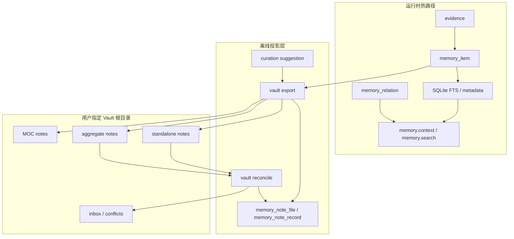

# Obsidian 记忆策展与关系图谱设计

> 状态：设计中  
> 更新日期：2026-06-10（策略修订：重要记忆单文件、全量重导出、笔记改完直写库）  
> 关联目标：目标 2「按类别形成掌握库」  
> 关联文档：`doc/shared/obsidian调研.md`

---

## 1. 背景与目标

The One 当前目标 1 已基本形成：在线召回依赖 SQLite 热索引、FTS、metadata、relation expansion 和上下文预算控制，不在在线路径扫描外部文件系统。

目标 2 希望在此基础上，把长期有价值的记忆沉淀为 Markdown，并通过 Obsidian 提供人工阅读、维护、分类和关系图谱能力。该能力本质上不是替代运行时记忆库，而是提供一个本地优先、可策展、可浏览、可形成知识网络的外部视图。

### 1.1 核心目标

| 目标 | 设计含义 |
|------|----------|
| 记忆可读 | 将 `memory_item` 投影为结构化 Markdown，用户可直接阅读 |
| 记忆可维护 | 用户可在 Vault 中补充解释、归类、建立链接 |
| 类别可重组 | 按项目、知识领域、思路方向、技能沉淀组织笔记 |
| 图谱可视化 | 通过 Obsidian 的 wikilink、tag、MOC 形成关系网络 |
| 在线路径隔离 | 在线召回只读 SQLite，不依赖 Vault、Obsidian API 或客户端常驻 |
| 可审计 | 导出、AI 策展建议、用户修改、冲突状态均有 hash 和元数据记录 |

### 1.2 非目标

| 非目标 | 原因 |
|--------|------|
| 不把 Vault 作为运行时真相源 | 文件系统扫描、Markdown 解析和链接解析不适合进入低延迟在线召回路径 |
| 不依赖 Obsidian API | 保持 Markdown/Vault 可移植，不要求 Obsidian 客户端常驻 |
| 不把用户手写的随意链接写入 `memory_relation` | 强关系以库为准并导出为链接；反向不把 Obsidian 联想当正式语义 |
| 不依赖 Git 回滚 | 冲突与变更检测由本地 hash、projection 表和 reconcile 状态处理 |
| 当前不处理跨设备冲突 | 一期按单机本地 Vault 设计，降低同步复杂度 |
| 非重要记忆的聚合文件不回写 DB | 多条低价值碎片合一文件，难以可靠反解到单条记忆 |
| 不在导出时合并旧文件内容 | 导出以数据库为准全量重写；用户移动文件后，下次导出按规范路径重新生成 |

---

## 2. 核心结论

采用「DB 主导、Markdown 策展投影」模型：

```text
memory_item / evidence / memory_relation
        ↓ offline export
Markdown Vault
        ↓
Obsidian wikilink / tag / MOC
        ↓
人工阅读、维护、分类、发现关联
```

系统边界固定为：

| 层级 | 定位 |
|------|------|
| `memory_item` | 运行时记忆原子，在线召回和生命周期治理的真相源 |
| standalone note | **所有重要记忆**各占一个文件；笔记改完可**直接覆盖**写回 `memory_item.content` |
| aggregate note | **仅非重要、低价值**记忆按主题合并；只导出、不回写 DB |
| MOC note | 多维导航和 Obsidian 图谱入口，不回写 DB |
| wikilink/tag | 重要记忆之间的关联主要靠 Obsidian 链接形成图谱；导出时把库内强关系写成链接 |
| `memory_relation` | 系统强语义关系，在线检索用；导出时投影为笔记内 `[[...]]`，不反向把随意链接写入此表 |
| 外部 AI | 离线策展助手，只生成建议、分组、摘要、标签和链接，不作为事实来源 |

**重要记忆判定**（满足任一即必须 standalone，不得并入 aggregate）：

- 类型为：`decision`、`constraint`、`failure`、`preference`、`review_checkpoint`
- 或配置中标记为「高影响」的记忆（`importance` 达到阈值）

重要记忆之间的关联**不合并进同一文件**，而通过导出 `memory_relation` 为 Obsidian 双向链接，在图谱中展示。

---

## 3. 架构设计

### 3.1 总体数据流



### 3.2 运行时与策展层隔离

在线召回路径：

```text
memory.context / memory.search
  -> SQLite FTS
  -> metadata filter
  -> memory_relation expansion
  -> rerank
  -> context budget injection
```

离线策展路径：

```text
theone vault export（全量以库为准，不读旧文件做合并）
  -> 读取 memory_item / evidence / memory_relation
  -> 重要记忆 -> 各生成一个 standalone 文件（强关系写成 [[链接]]）
  -> 非重要记忆 -> 按主题生成 aggregate 文件
  -> 按规范路径写入；删除库中已删除记忆对应的 Markdown
  -> 清理本次导出清单外的旧投影文件（含用户拖走/改路径后的残留）
  -> 更新 projection 表与 hash
```

```text
theone vault reconcile
  -> 读取 projection 表与 Vault 文件
  -> 计算 file / record hash，识别变更
  -> standalone：`## Memory` 正文变更 -> 直接覆盖写回 memory_item.content（version+1，同步 FTS）
  -> aggregate：只记录状态，不回写 DB
  -> 用户仅移动/改名文件：不单独处理；下次 export 按规范路径重写并清理残留
```

---

## 4. 文件模型

### 4.1 文件模式

| 文件模式 | 内容 | 是否允许回写 DB | 典型场景 |
|----------|------|----------------|----------|
| `standalone` | **每条重要记忆一个文件** | `reconcile` 时 `## Memory` 直接覆盖写回库 | 决策、约束、失败经验、偏好、复查检查点 |
| `aggregate` | **仅非重要**记忆的多条碎片合并 | 不回写 DB | 同主题短期碎片、低价值过程记录 |
| `moc` | Map of Content 导航页 | 不回写 DB | 项目索引、知识领域索引、技能索引、方向索引 |
| `inbox` | 待处理、未归类、冲突、解析失败 | 通过显式命令处理 | pending review、sync conflict、ungrouped |
| `archive` | 已归档投影 | 不回写 DB | 历史阶段、过期主题 |

### 4.2 记忆与文件关系

运行时记忆仍是原子：

```text
memory_item.id = 运行时记忆原子
```

Markdown 文件是策展单元：

```text
Markdown file = standalone note / aggregate note / MOC note
```

文件内 record 是可定位投影单元：

```text
memory_note_record.memory_id -> doc_path + record_anchor + record_hash
```

该模型允许：

- 所有重要记忆各自独立成文，彼此用 Obsidian 链接连成图谱。
- 仅非重要、低价值碎片合并进 aggregate。
- 导出全量以库为准，不保留用户对路径/旧文件内容的合并结果。
- 库中记忆删除时，对应 Markdown 一并删除。
- reconcile 时 standalone 正文可直接写回库。

---

## 5. Vault 目录结构

Vault 根目录由用户指定，不在代码中固定。目录只承载主分类维度，跨维度关系通过 tag、frontmatter、wikilink 和 MOC 解决。

推荐结构：

```text
VaultRoot/
  00-inbox/
    pending-review/
    sync-conflicts/
    ungrouped/

  10-projects/
    the-one/
      architecture/
      decisions/
      constraints/
      failures/
      workflows/
      topics/

  20-knowledge/
    distributed-systems/
    memory-systems/
    security/
    databases/
    ai-agents/

  30-thinking/
    product-direction/
    architecture-principles/
    tradeoff-patterns/
    research-threads/

  40-skills/
    go/
    python/
    kubernetes/
    cryptography/

  80-moc/
    project-the-one.md
    knowledge-memory-systems.md
    direction-obsidian-curation.md

  90-archive/
```

目录选择规则：

| 记忆类别 | 默认目录 |
|----------|----------|
| 项目事实、项目决策、项目约束 | `10-projects/<project>/<category>/` |
| 跨项目知识 | `20-knowledge/<domain>/` |
| 长期思路、方法论、技术方向 | `30-thinking/<direction>/` |
| 技能、操作流程、能力沉淀 | `40-skills/<skill>/` |
| 未分组、待审核、冲突 | `00-inbox/<bucket>/` |
| 已归档内容 | `90-archive/<topic>/` |

---

## 6. Markdown 结构规范

### 6.1 文件级 frontmatter

文件级 frontmatter 描述策展单元，而不是单条记忆。

```yaml
---
theone_note_id: note_20260610_memory_vault_design
schema_version: 1
note_mode: aggregate
sync_policy: export_only
scope: project_local
workspace_id: default
project_id: the-one
repo_id: /Users/zaneway/SynologyDrive/code-space/GolandProjects/the-one
topic:
  primary: obsidian-memory-curation
  domain: memory-system
  direction: knowledge-graph
tags:
  - theone/project/the-one
  - theone/domain/memory-system
  - theone/direction/knowledge-graph
created_at: 2026-06-10T10:20:00+08:00
updated_at: 2026-06-10T10:30:00+08:00
sync:
  db_primary: true
  status: synced
  file_hash: sha256:<file-content-hash>
  frontmatter_hash: sha256:<frontmatter-content-hash>
---
```

字段说明：

| 字段 | 说明 |
|------|------|
| `theone_note_id` | 文件级投影 ID |
| `note_mode` | `standalone`、`aggregate`、`moc`、`inbox`、`archive` |
| `sync_policy` | `bidirectional_overwrite`、`export_only`、`ignore_user_edits` |
| `topic` | 主题归类，用于目录、MOC 和 AI 分组 |
| `tags` | Obsidian 图谱和过滤使用 |
| `sync.file_hash` | 上次导出或观测到的文件 hash |
| `sync.frontmatter_hash` | 文件级元数据 hash |

### 6.2 聚合文件结构

聚合文件仅包含系统生成的记录块（下次 export 整文件覆盖，不保留旧内容）：

```markdown
# 主题：某项目本周碎片摘要

<!-- theone:managed:start -->

### 某条过程记录 ^mem_abc123

<!-- theone:record
id: mem_abc123
record_id: R-001
memory_type: project_fact
state: stable
tier: short_term
importance: 0.3
record_hash: sha256:<record-content-hash>
-->

这是一条非重要的过程性记录正文。

<!-- theone:managed:end -->
```

聚合文件的行为约束：

- 只收纳**非重要**记忆；重要记忆不得出现在 aggregate 中。
- 全文由 export 生成；**不**与旧文件合并。
- 用户若在 Obsidian 中修改 aggregate，变更**不回写**数据库；下次 export 会覆盖文件。

### 6.3 standalone 文件结构

每条重要记忆一个 standalone 文件；`## Memory` 与库中 `content` 双向同步：

```markdown
---
theone_note_id: note_mem_decision_001
schema_version: 1
note_mode: standalone
sync_policy: bidirectional_overwrite
memory_id: mem_decision_001
scope: project_local
workspace_id: default
project_id: the-one
tags:
  - theone/type/decision
  - theone/state/stable
---

# 决策：在线召回不读 Vault

<!-- theone:record
id: mem_decision_001
memory_type: decision
state: stable
record_hash: sha256:<memory-section-hash>
-->

## Memory

在线召回只读 SQLite 热索引，不读 Vault。Vault 只用于离线阅读与图谱。

## Relations

- 支持 [[mem_a13c9d20-no-vault-read]]
- 取代 [[mem_c92ad001-old-design]]

## Evidence

- `ev_decision_001`：用户在会话中明确该约束。

```

说明：

- `## Memory`：与 `memory_item.content` 对应；用户在 Obsidian 修改后，`vault reconcile` **直接覆盖**写回数据库（`version+1`，同步 FTS）。
- `## Relations`：由 `memory_relation` 导出为带语义前缀的 `[[wikilink]]`（支持 / 冲突 / 取代等），用于 Obsidian 关系图谱。
- `## Evidence`：只读展示，export 时从库生成；reconcile 不以 Evidence 段回写库。
- 文件名建议稳定：`mem_<短id>-<可读slug>.md`，便于链接 resolve。

---

## 7. 关系模型

### 7.1 三类关系

| 关系类型 | 来源 | 作用 | 是否进入在线召回 |
|----------|------|------|------------------|
| 强关系投影链接 | 库表 `memory_relation` 导出为 standalone 内 `[[...]]` | Obsidian 图谱展示正式关联（支持/冲突/取代等） | 否（在线仍读 `memory_relation` 表） |
| Obsidian 弱关联 | 用户手写 wikilink、tag、MOC | 人工浏览、发现潜在关联 | 否 |
| 文件聚合关系 | 同一 aggregate 内多条非重要 record | 主题归类、碎片归档 | 否 |

重要记忆**不**靠「合并进同一文件」表达关联，而靠**单文件 + 链接**在图谱中连成网络。

### 7.2 强关系导出为笔记链接

`vault export` 读取 `memory_relation`，在 standalone 的 `## Relations` 段写入 Obsidian 链接，例如：

| 库内关系类型 | 笔记中的写法（示例） |
|-------------|---------------------|
| `supports` | `- 支持 [[mem_xxx-slug]]` |
| `contradicts` | `- 冲突 [[mem_yyy-slug]]` |
| `supersedes` | `- 取代 [[mem_zzz-slug]]` |
| `derived_from`（证据） | 也可在 `## Evidence` 用 `[[ev_...]]` 展示 |

链接目标解析到**对方 standalone 文件的稳定路径**（含 `memory_id` 的 slug），保证图谱可跳转。

**单向规则**：

- 库 → 笔记：强关系**必须**导出为链接。
- 笔记 → 库：用户随意新增的 wikilink **不自动**写入 `memory_relation`；`reconcile` 当前只回写 `## Memory` 正文。

### 7.3 强关系的写入来源（库内真相）

`memory_relation` 仍只来自可信流程，不由 Obsidian 随意链接反向生成：

| 来源 | 示例 |
|------|------|
| 用户显式确认 | 审核时确认 A 取代 B |
| 自动化纠错流程 | 用户纠正旧记忆后写入 supersedes |
| 高置信规则 | 已有 correction / admission 流程 |

### 7.4 弱链接索引

用户手写的额外 `[[...]]` 可离线解析进 `memory_note_link`，用于孤立节点分析、MOC 建议；不参与在线 relation expansion。

---

## 8. 分组与聚合策略

### 8.1 总原则：重要单文件，非重要才合并

```text
若判定为重要记忆 -> 一律 standalone（一条记忆一个文件）
若判定为非重要记忆 -> 可按主题合并为 aggregate
重要记忆之间的关联 -> 不写进同一文件，由 memory_relation 导出为 [[链接]]
```

**不得**因「主题相近」「同属一个决策链」把重要记忆合并进 aggregate。

### 8.2 重要记忆判定

满足**任一**即为重要，必须 standalone：

| 条件 | 说明 |
|------|------|
| 类型 | `decision`、`constraint`、`failure`、`preference`、`review_checkpoint` |
| 重要性阈值 | `importance` ≥ 配置阈值（默认 0.7，可配） |

### 8.3 非重要记忆的聚合分组

仅对非重要记忆，按以下优先级归入同一 aggregate：

```text
同一项目 / scope
  > 同一主题 key
  > 共享 tags / entities
  > 时间接近（如同一周、同一迭代）
  > 类型相近
```

有 `contradicts` 关系的多条**非重要**记录，可合并为「争议/过程记录」aggregate；**重要**的冲突对仍各为 standalone，靠链接相连。

### 8.4 文件模式选择

| 条件 | 输出模式 |
|------|----------|
| 重要记忆 | `standalone`（强制） |
| 多条非重要、同主题碎片 | `aggregate` |
| 项目/领域导航 | `moc` |
| 无法分类的非重要记忆 | `00-inbox/ungrouped` |
| reconcile 解析失败 | `00-inbox/sync-conflicts` |

---

## 9. 外部 AI 介入点

外部 AI 只参与离线策展链路，不进入在线召回链路。

### 9.1 可用场景

| 环节 | AI 作用 | 是否自动落库 |
|------|---------|--------------|
| 记忆分组 | 判断哪些 memory 应聚合到同一主题文件 | 否，生成建议 |
| 主题命名 | 生成文件标题、topic key、MOC 标题 | 可自动写投影文件 |
| 目录归类 | 建议进入 project、knowledge、thinking、skills 哪个目录 | 可自动，保留人工迁移 |
| 标签生成 | 生成 domain、project、direction、skill tags | 默认建议，重要标签需审核 |
| 链接推荐 | 为非重要碎片推荐 `[[wikilink]]` | 可写 Markdown；**不**自动写 `memory_relation`（强关系仍走库内流程） |
| 聚合摘要 | 为 aggregate note 生成主题摘要 | 可写投影文件 |
| 冲突解释 | 对 hash 冲突生成差异解释 | 否，只生成诊断 |
| 盲区分析铺垫 | 基于 failure/open_issue/review_checkpoint 提出潜在缺口 | 否，目标 3 再治理 |

### 9.2 AI 输出治理

外部 AI 输出必须记录：

- provider
- model
- prompt version
- input hash
- output hash
- confidence
- suggestion type
- applied/rejected 状态

AI 输出不能直接改变：

- `memory_item.content`
- `memory_relation`
- `memory_item.state`
- `memory_item.tier`

AI 建议若涉及高影响记忆，应进入 `pending_review` 或仅写入 Markdown 策展区。

### 9.3 建议表

```sql
create table if not exists memory_curation_suggestion (
  id                         text primary key,
  suggestion_type            text not null,
  source_memory_ids_json      text not null,
  target_note_file_id         text,
  suggestion_json             text not null,
  provider                    text,
  model                       text,
  prompt_version              text,
  input_hash                  text,
  output_hash                 text,
  confidence                  real,
  status                      text not null,
  created_at                  datetime not null,
  reviewed_at                 datetime
);
```

`suggestion_type` 可选值：

- `group`
- `title`
- `directory`
- `tag`
- `wikilink`
- `summary`
- `conflict_explanation`
- `gap_signal`

---

## 10. 同步与 Reconcile

### 10.0 导出原则（全量以库为准）

| 规则 | 说明 |
|------|------|
| 不合并旧文件 | `vault export` 按当前库状态生成内容，**不**读取旧 Markdown 做增量合并 |
| 规范路径唯一 | 每条记忆的输出路径由 planner 决定；用户拖走/改名文件后，**下次 export 仍在规范路径重新生成** |
| 清理残留 | export 结束时删除「本次导出清单之外」且属于系统投影的旧 `.md`（含用户挪走后的原路径残留） |
| 库删文件删 | 库中 `memory_item` 为 `deleted` / 硬删除时，删除对应 Markdown 与 projection 记录 |
| 库变文件盖 | 库中内容变更后 export，**覆盖**规范路径下的文件全文 |

### 10.1 同步策略

| `sync_policy` | 说明 |
|---------------|------|
| `bidirectional_overwrite` | standalone：`## Memory` 变更经 reconcile **直接覆盖** `memory_item.content` |
| `export_only` | 仅库 → 笔记；笔记改动不回写库，下次 export 覆盖 |
| `ignore_user_edits` | 系统全权管理（如 MOC 模板），用户改动在 export 时被覆盖 |

默认策略：

| 文件模式 | 默认 `sync_policy` |
|----------|-------------------|
| `standalone` | `bidirectional_overwrite` |
| `aggregate` | `export_only` |
| `moc` | `export_only` |
| `inbox` | `export_only` |
| `archive` | `ignore_user_edits` |

### 10.2 Hash 层级

为避免无法定位用户修改，至少记录三层 hash：

| Hash | 作用 |
|------|------|
| `file_hash` | 判断整个文件是否变化 |
| `frontmatter_hash` | 判断文件级元数据是否变化 |
| `record_hash` | 判断单条 record 管理块是否变化 |

对于 `aggregate` 文件，`record_hash` 仅用于 reconcile 诊断；export 始终整文件覆盖。

计算 `frontmatter_hash` / `file_hash` 时，**排除** `sync.file_hash`、`sync.frontmatter_hash` 等自指字段，避免循环。

### 10.3 状态机

| 状态 | 含义 |
|------|------|
| `synced` | DB 与规范路径下文件 hash 一致 |
| `db_changed` | 库中记忆已变，文件未更新（待 export） |
| `note_changed` | standalone 的 `## Memory` 已变，库未更新（待 reconcile 写回） |
| `both_changed` | 库与文件均变（以 reconcile 策略：standalone 用文件覆盖库，或先 export 以库为准——见 10.4） |
| `orphan_path` | 文件不在规范路径（用户挪动）；待下次 export 清理或重写 |
| `note_missing` | 规范路径下文件缺失（待 export 补写） |
| `invalid_schema` | frontmatter / record 解析失败 |

### 10.4 场景处理

| 场景 | 行为 |
|------|------|
| 库中记忆更新 | `vault export` 覆盖规范路径下对应 Markdown |
| 库中记忆删除 | 删除对应 Markdown + 清理 projection 行 |
| standalone `## Memory` 被用户修改 | `vault reconcile` 解析后**直接覆盖** `memory_item.content`，`version+1`，同步 FTS |
| standalone `## Relations` / Evidence 被改 | 不回写 `memory_relation` / evidence；下次 export 按库重新生成这两段 |
| aggregate 任意修改 | 不回写库；下次 export 整文件覆盖 |
| 用户拖走/改名文件 | 不即时处理；下次 export 在规范路径重建，并删除投影清单外残留文件 |
| 用户删除 standalone 文件 | `reconcile` 可报 `note_missing`；**不**删库中记忆；下次 export 补回 |
| 用户删除 aggregate 文件 | 同上，export 补回 |
| schema 无法解析 | 写入 `00-inbox/sync-conflicts`，不自动写库 |

**`both_changed` 默认策略**：先执行 `reconcile` 把 standalone 正文写回库，再执行 `export` 刷新 Relations/Evidence 等与库一致的部分；若配置 `export_wins_on_conflict=true` 则跳过 reconcile，以库为准 export 覆盖文件。

---

## 11. 数据模型

### 11.1 文件投影表

```sql
create table if not exists memory_note_file (
  id                    text primary key,
  vault_root             text not null,
  doc_path               text not null,
  note_mode              text not null,
  sync_policy            text not null,
  scope                  text,
  workspace_id           text,
  project_id             text,
  repo_id                text,
  topic_key              text,
  file_hash              text,
  frontmatter_hash       text,
  sync_status            text not null,
  conflict_reason        text,
  created_at             datetime not null,
  updated_at             datetime not null
);

create unique index if not exists idx_memory_note_file_path
  on memory_note_file(vault_root, doc_path);
```

### 11.2 record 投影表

```sql
create table if not exists memory_note_record (
  memory_id                  text primary key,
  note_file_id               text not null,
  doc_path                   text not null,
  record_anchor              text not null,
  record_id                  text not null,
  exported_memory_version    integer,
  exported_record_hash       text,
  observed_record_hash       text,
  sync_status                text not null,
  conflict_reason            text,
  last_exported_at           datetime,
  last_imported_at           datetime,
  updated_at                 datetime not null
);

create index if not exists idx_memory_note_record_file
  on memory_note_record(note_file_id, record_id);
```

### 11.3 Obsidian 弱链接索引

```sql
create table if not exists memory_note_link (
  id                    text primary key,
  note_file_id           text not null,
  source_memory_id       text,
  source_anchor          text,
  target_note_path       text,
  target_memory_id       text,
  unresolved_target      text,
  link_text              text not null,
  link_origin            text not null,
  created_at             datetime not null,
  updated_at             datetime not null
);
```

`memory_note_link` 不参与在线 relation expansion，只服务诊断、MOC 生成和 Obsidian 图谱质量分析。

---

## 12. 配置设计

```yaml
vault:
  enabled: true
  root: "~/.theone/obsidian-vault"
  mode: "db_primary"
  export_states:
    - stable
    - pending_review
  export_types:
    - preference
    - requirement
    - decision
    - constraint
    - assumption
    - open_issue
    - failure
    - project_fact
    - procedure
    - review_checkpoint
  default_sync_policy:
    standalone: bidirectional_overwrite
    aggregate: export_only
    moc: export_only
  export_mode: full_regenerate
  importance_threshold: 0.7
  relation_policy: export_strong_relations_as_wikilinks
  reconcile_on_both_changed: file_to_db_first
  ai_curation:
    enabled: false
    provider: ""
    model: ""
    require_review_for_high_impact: true
```

配置约束：

- `root` 必须由用户显式指定或初始化生成。
- 所有写文件操作必须限制在 `root` 内，拒绝绝对路径逃逸和符号链接逃逸。
- `ai_curation.enabled=false` 时，系统仍可完成规则化导出。
- `export_mode=full_regenerate`：export 不与旧文件合并，并清理投影清单外残留。
- `relation_policy=export_strong_relations_as_wikilinks`：库内强关系导出为笔记链接；用户手写链接不反向写入库。

---

## 13. CLI 与工具能力

建议新增命令：

```bash
theone vault init
theone vault export
theone vault status
theone vault reconcile
theone vault suggest
theone vault check
```

| 命令 | 作用 |
|------|------|
| `vault init` | 初始化 Vault 目录、模板、MOC 基础文件 |
| `vault export` | 从 DB 导出 standalone、aggregate、MOC 文件 |
| `vault status` | 展示文件变化、record 变化、冲突、缺失 |
| `vault reconcile` | 执行 hash 比对和受控回流，不直接覆盖 DB |
| `vault suggest` | 调用外部 AI 生成分组、标签、链接、摘要建议 |
| `vault check` | 校验 frontmatter、record metadata、坏链、重复 ID |

MCP 工具可以后置，不作为一期必须项。原因是 Vault 策展属于离线管理任务，CLI 更容易控制文件写入和用户确认边界。

---

## 14. 模块划分

建议新增模块：

```text
internal/vault/
  config.go          # vault 配置与校验
  model.go           # note file / record / link / suggestion 领域对象
  planner.go         # memory -> note grouping / routing
  render.go          # Markdown 渲染
  parser.go          # frontmatter / record / wikilink 解析
  hash.go            # file/frontmatter/record hash
  reconcile.go       # 状态机与冲突处理
  repository.go      # projection 表接口
  ai.go              # 外部 AI 策展建议接口
```

可复用现有模块：

| 现有模块 | 复用方式 |
|----------|----------|
| `internal/memory` | 读取 `memory_item`；reconcile 调用 `Edit` 覆盖 content |
| `internal/storage/sqlite` | 增加 projection repository 和 migrations |
| `internal/docindex` | 复用 Markdown 安全路径、hash、章节快照思想，但不要混入 Vault 业务语义 |
| `internal/automation` | 外部 AI 建议可作为离线 job，但不进入在线召回 |
| `internal/retrieval` | 不读取 Vault，只继续读 SQLite 热索引 |

---

## 15. 实现分期

### 15.1 Phase 1：单向投影 MVP

目标：可生成 Obsidian 可读、可成图的 Markdown Vault。

范围：

- 增加 vault 配置。
- 增加 `memory_note_file`、`memory_note_record` 表。
- 实现 `vault init`。
- 实现 `vault export`。
- 支持 standalone / aggregate / MOC 三类文件。
- 重要记忆强制 standalone；`memory_relation` 导出为 `## Relations` 链接。
- 全量 export（不合并旧文件）；库删记忆则删 Markdown。
- Phase 1 不做 reconcile 回流。

验收：

- 在线 `memory.context` 不读取 Vault。
- 可指定 Vault 根目录。
- stable/pending_review 记忆可导出；重要记忆各占一个文件。
- Obsidian 打开后能通过强关系 wikilink、tag、MOC 形成图谱。
- 重复 export 不产生重复 record；规范路径唯一。

### 15.2 Phase 2：Hash 诊断与 Reconcile

目标：standalone 笔记改完写回库；export 全量以库为准并清理残留。

范围：

- 计算 file/frontmatter/record hash（含 hash 排除字段规则）。
- 实现 `vault status`。
- 实现 `vault reconcile`：standalone `## Memory` 变更直接覆盖 `memory_item.content`。
- `vault export` 全量重写 + 库删文件删 + 清理投影外残留。
- aggregate 修改不回写库；export 覆盖 aggregate 全文。

验收：

- 重要记忆均为 standalone，且 `## Relations` 含强关系链接。
- 用户改 standalone 正文后 reconcile 可写回库。
- 库中删除记忆后 export 删除对应 Markdown。
- 用户拖走文件后，下次 export 在规范路径重建并清理旧路径残留。
- 用户删 Markdown 不删库；export 可补回。

### 15.3 Phase 3：外部 AI 策展建议

目标：用 AI 降低人工整理成本，但保持建议可审计。

范围：

- 实现 `vault suggest`。
- 支持分组、标题、目录、标签、wikilink、摘要建议。
- 增加 `memory_curation_suggestion` 表。
- 高影响建议默认需要 review。

验收：

- AI 输出有 provider/model/prompt/input_hash/output_hash。
- AI 不直接改 `memory_item.content`。
- AI 不直接写 `memory_relation`。
- 关闭 AI 后系统仍可完整运行。

### 15.4 Phase 4：图谱质量与目标 3 铺垫

目标：为掌握度、盲区分析准备数据基础。

范围：

- 解析 `memory_note_link`。
- 生成孤立节点报告。
- 生成过度连接报告。
- 按 failure/open_issue/review_checkpoint 聚合潜在盲区信号。
- 形成 skill/topic 维度的 MOC。

验收：

- 能识别没有任何入链/出链的记忆投影。
- 能识别同主题下长期未关闭的 open issue。
- 不直接生成能力评价结论，只输出 evidence-based 信号。

---

## 16. 风险与边界条件

| 风险 | 说明 | 缓解 |
|------|------|------|
| 聚合文件难以回流 | 多条碎片合一文件，无法可靠反解 | 仅非重要记忆进 aggregate；不回写 DB |
| 用户改 Relations 与库不一致 | 用户可改链接段，但库未变 | export 会按库重写 Relations；正文以 reconcile 写回为准 |
| Obsidian 随意链接污染强关系 | 手写链接语义不明 | 不反向写入 `memory_relation`；强关系只从库导出 |
| 外部 AI 引入幻觉 | AI 可能错误分组或生成错误摘要 | AI 只生成 suggestion，保留审计 hash，高影响需 review |
| 文件系统安全 | 用户指定 Vault root，可能出现路径逃逸或符号链接逃逸 | 所有路径经 root 校验，拒绝 `..`、绝对路径和 symlink escape |
| 重复导出 | 同一记忆被多次写入不同文件 | `memory_note_record.memory_id` 唯一约束 |
| 用户删除 Markdown | 误删不应导致库中记忆消失 | reconcile 报缺失；export 按库补回文件 |
| 库中删除记忆 | Vault 残留过期笔记 | export 删除对应 Markdown |
| 用户拖走文件 | 路径与 projection 不一致 | 下次 export 规范路径重建并清理残留 |
| 在线性能退化 | 若 retrieval 读取 Vault，会破坏目标 1 | 明确禁止在线路径依赖 Vault |

---

## 17. 验收标准

### 17.1 架构验收

- 在线召回只读 SQLite，不读 Vault。
- Vault 根目录由用户指定。
- 不依赖 Obsidian API 或客户端常驻。
- 不依赖 Git 回滚。
- 不处理跨设备冲突。

### 17.2 Markdown 验收

- 每个文件包含结构化 frontmatter。
- **重要记忆均为 standalone**，每条一个文件。
- standalone 含 `## Memory`、`## Relations`（强关系链接）、`## Evidence`。
- Obsidian 可通过 wikilink、tag、MOC 形成关系图谱。
- aggregate 仅含非重要记忆，export 整文件覆盖。

### 17.3 同步验收

- standalone 的 `## Memory` 修改经 reconcile **直接覆盖**库中 content。
- aggregate 修改不回写库；export 覆盖全文。
- export 全量以库为准，不合并旧文件；库删则 Markdown 删。
- 用户移动文件后，export 在规范路径重建并清理残留。
- 文件 hash、frontmatter hash、record hash 可用于变更检测。

### 17.4 AI 验收

- AI 只参与离线策展建议。
- AI 输出有完整审计元数据。
- AI 不直接写 `memory_item.content`。
- AI 不直接写 `memory_relation`。
- 关闭 AI 后系统仍可完成导出和图谱构建。

---

## 18. 推荐落地顺序

优先落 Phase 1 和 Phase 2：

1. 先实现全量 export：重要记忆单文件、强关系变链接、库删文件删。
2. 再实现 reconcile：standalone 正文改完直写库。
3. 最后引入外部 AI 做非重要碎片的分组、标签、摘要建议。

该顺序在保持在线召回只读 SQLite 的前提下，让 Obsidian 成为「重要记忆单页 + 链接图谱」的可维护视图。
